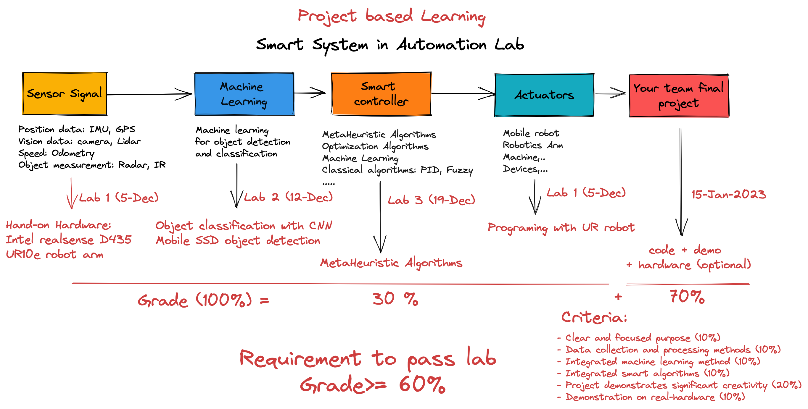

# Smart Systems in Automation (VGU)
### Overview Lab Smart Systems in Automation 2022. 
#### This is the project-based learning lab, you must finish all the lab exercises and make a final project meet with criteria to complete the lab.

### A. Hardware (Pick your tools!!)

As you know, our lab focus on research topic is Autonomous robot and SLAM. Here some types of equipment will help you to finish this lab project.
- Industrial robotics arm UR10e (Link tutorial: https://tribien.gitbook.io/ur-robot-tutorial/)
- Camera: Intel realsense D435 (https://www.intelrealsense.com/depth-camera-d435/, https://intelrealsense.github.io/librealsense/python_docs/_generated/pyrealsense2.html)

### B. Install all software

To prepare the Lab SSA2022 in Python environment, follow the steps below:

- Download [PyCharm](https://www.jetbrains.com/pycharm/download/#section=windows) integrated development environment or [Anaconda](https://docs.anaconda.com/anaconda/install/windows/) package and environment manager.
- Download [Python 3.7](https://www.python.org/downloads/release/python-3710/) or later 
- Download [get-pip.py](https://bootstrap.pypa.io/get-pip.py) and run the following commands in PyCharm terminal: 
    - ***python get-pip.py*** &emsp;&emsp;&emsp;&emsp;&nbsp;Pip tool to install Pip Python package
    - ***pip install pyrealsense2*** &emsp;&nbsp;Intel RealSense cross-platform open-source API
    - ***pip install numpy*** &emsp;&emsp;&emsp;&emsp;&nbsp;Fundamental package for scientific computing
    - ***pip install matplotlib*** &emsp;&emsp;&ensp;&nbsp;2D plotting library producing publication quality figures
    - ***pip install opencv-python***&nbsp;&nbsp;OpenCV packages for Python
    - ***pip install tensorflow***&nbsp;&nbsp;&nbsp;&nbsp;&nbsp;&nbsp;&nbsp;&nbsp;  Tensorflow packages for Machine learning lab
      
        some of these packages are not directly used here, but maybe useful in other examples

### C. Content:  
- Lab 1: Hand-on Robotics hardware (10%)
- Lab 2: Machine Learning in Image Processing (10%)
- Lab 3. Meta Heuristic Algorithms (10%)

### D. Final Project Criteria:
- Clear and focused purpose (10%)
- Data collection and processing methods (10%)
- Integrated machine learning algorithm (10%)
- Integrated smart algorithms (10%)
- Project demonstrates significant creativity (20%)
- Demonstration on real-hardware (10%)
